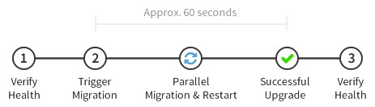

## Allow-legacy mode

Allow-legacy is a special mode in etcd that contains logic to enable a running etcd cluster to smoothly transition between major versions of etcd. For example, the internal API versions between etcd 0.4 (internal v1) and etcd 2.0 (internal v2) aren't compatible and the cluster needs to be updated all at once to make the switch. To minimize downtime, allow-legacy coordinates with all of the members of the cluster to shutdown, migration of data and restart onto the new version.

Allow-legacy helps users upgrade v0.4 etcd clusters easily, and allows your etcd cluster to have a minimal amount of downtime -- less than 1 minute for clusters storing less than 50 MB.

It supports upgrading from internal v1 to internal v2 now.

### Setup

This mode is enabled if `ETCD_ALLOW_LEGACY_MODE` is set to true, or etcd is running in CoreOS system.

It treats `ETCD_BINARY_DIR` as the directory for etcd binaries, which is organized in this way:

```
ETCD_BINARY_DIR
  |
  -- 1
  |
  -- 2
```

`1` is etcd with internal v1 protocol. You should use etcd v0.4.7 here. `2` is etcd with internal v2 protocol, which is etcd v2.x.

The default value for `ETCD_BINARY_DIR` is `/usr/libexec/etcd/internal_versions/`.

### Upgrading a Cluster

When starting etcd with a v1 data directory and v1 flags, etcd executes the v0.4.7 binary and runs exactly the same as before. To start the migration, follow the steps below:



#### 1. Check the Cluster Health

Before upgrading, you should check the health of the cluster to double check that everything working perfectly. Check the health by running:

```
$ etcdctl cluster-health
cluster is healthy
member 6e3bd23ae5f1eae0 is healthy
member 924e2e83e93f2560 is healthy
member a8266ecf031671f3 is healthy
```

If the cluster and all members are healthy, you can start the upgrading process. If not, check the unhealthy machines and repair them using [admin guide](./admin_guide.md).

#### 2. Trigger the Upgrade

When you're ready, use the `etcdctl upgrade` command to start the upgrade the etcd cluster to 2.0:

```
# Defaults work on a CoreOS machine running etcd
$ etcdctl upgrade
```

```
# Advanced example specifying a peer url
$ etcdctl upgrade --old-version=1 --new-version=2 --peer-url=$PEER_URL
```

`PEER_URL` can be any accessible peer url of the cluster.

Once triggered, all peer-mode members will print out:

```
detected next internal version 2, exit after 10 seconds.
```

#### Parallel Coordinated Upgrade

As part of the upgrade, etcd does internal coordination within the cluster for a brief period and then exits. Clusters storing 50 MB should be unavailable for less than 1 minute.

#### Restart etcd Processes

After the etcd processes exit, they need to be restarted. You can do this manually or configure your unit system to do this automatically. On CoreOS, etcd is already configured to start automatically with systemd.

When restarted, the data directory of each member is upgraded, and afterwards etcd v2.0 will be running and servicing requests. The upgrade is now complete!

Standby-mode members are a special case &mdash; they will be upgraded into proxy mode (a new feature in etcd 2.0) upon restarting. When the upgrade is triggered, any standbys will exit with the message:

```
Detect the cluster has been upgraded to internal API v2. Exit now.
```

Once restarted, standbys run in v2.0 proxy mode, which proxy user requests to the etcd cluster.

#### 3. Check the Cluster Health

After the upgrade process, you can run the health check again to verify the upgrade. If the cluster is unhealthy or there is an unhealthy member, please refer to start [failure recovery](#failure-recovery).

### Downgrade

If the upgrading fails due to disk/network issues, you still can restart the upgrading process manually. However, once you upgrade etcd to internal v2 protocol, you CANNOT downgrade it back to internal v1 protocol. If you want to downgrade etcd in the future, please backup your v1 data dir beforehand.

### Upgrade Process on CoreOS

When running on a CoreOS system, allow-legacy mode is enabled by default and an automatic update will set up everything needed to execute the upgrade. The `etcd.service` on CoreOS is already configured to restart automatically. All you need to do is run `etcdctl upgrade` when you're ready, as described

### Internal Details

etcd v0.4.7 registers versions of available etcd binaries in its local machine into the key space at bootstrap stage. When the upgrade command is executed, etcdctl checks whether each member has internal-version-v2 etcd binary around. If that is true, each member is asked to record the fact that it needs to be upgraded the next time it reboots, and exits after 10 seconds.

Once restarted, etcd v2.0 sees the upgrade flag recorded. It upgrades the data directory, and executes etcd v2.0.

### Failure Recovery

If `etcdctl cluster-health` says that the cluster is unhealthy, the upgrade process fails, which may happen if the network is broken, or the disk cannot work.

The way to recover it is to manually upgrade the whole cluster to v2.0:

- Log into machines that ran v0.4 peer-mode etcd
- Stop all etcd services
- Remove the `member` directory under the etcd data-dir
- Start etcd service using [2.0 flags](configuration.md). An example for this is:
```
$ etcd --data-dir=$DATA_DIR --listen-peer-urls http://$LISTEN_PEER_ADDR \
    --advertise-client-urls http://$ADVERTISE_CLIENT_ADDR \
    --listen-client-urls http://$LISTEN_CLIENT_ADDR
```
- When this is done, v2.0 etcd cluster should work now.
