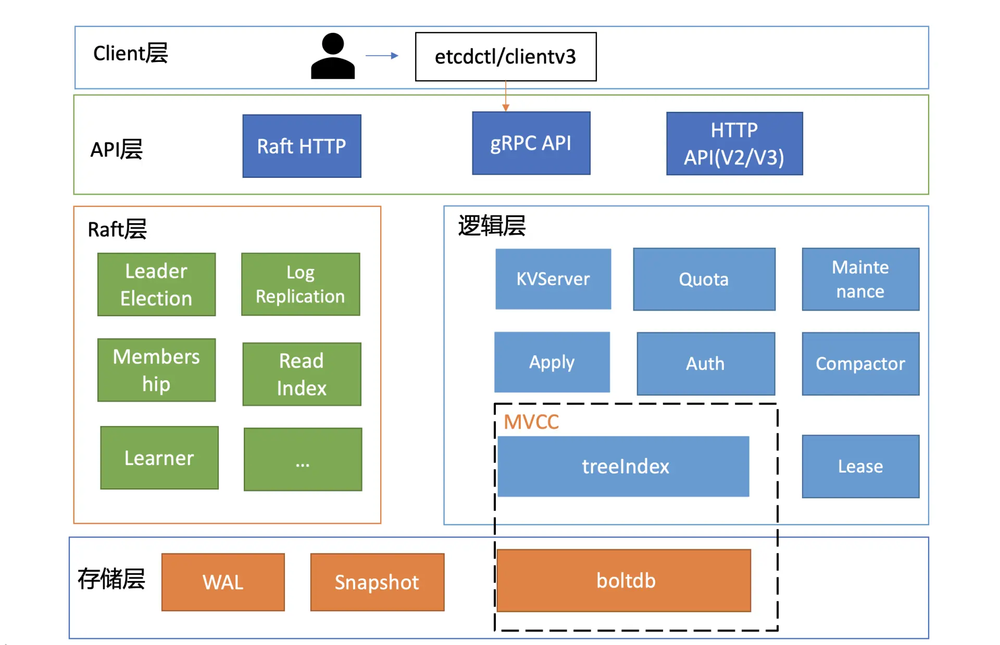
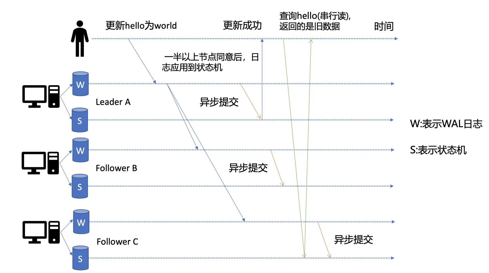
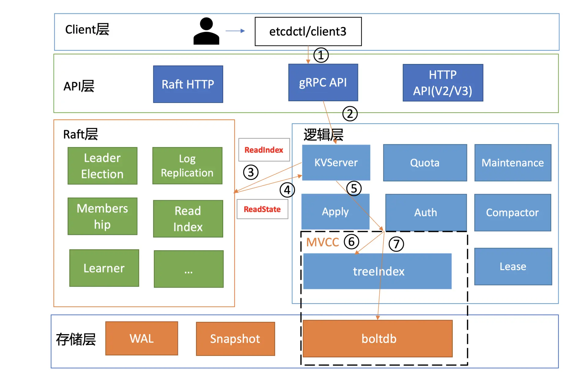
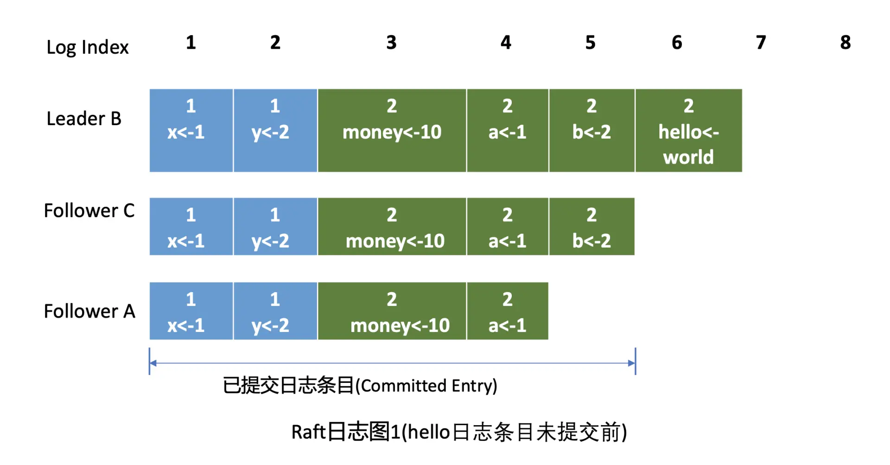
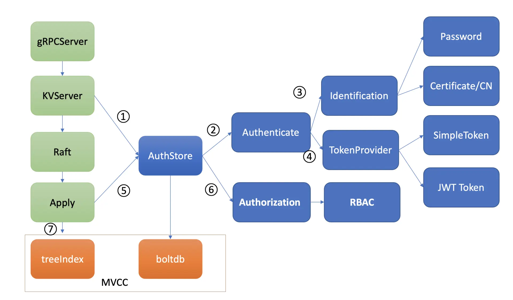
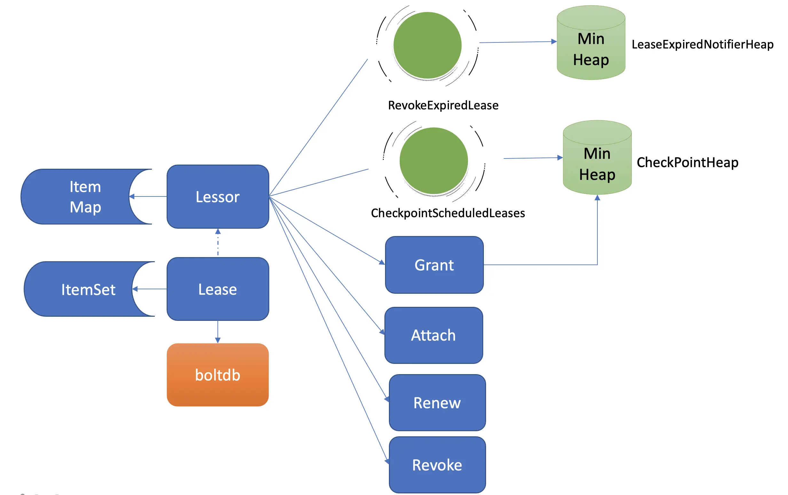
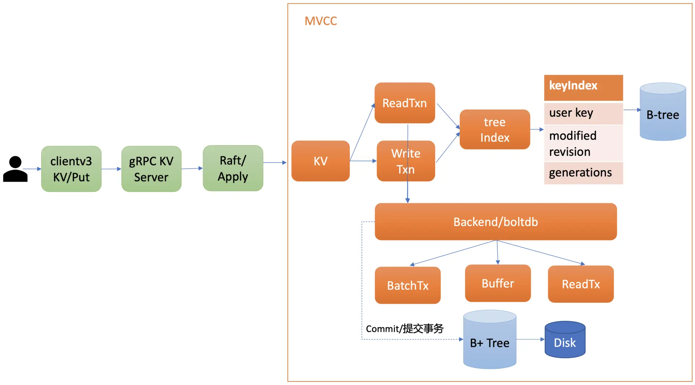
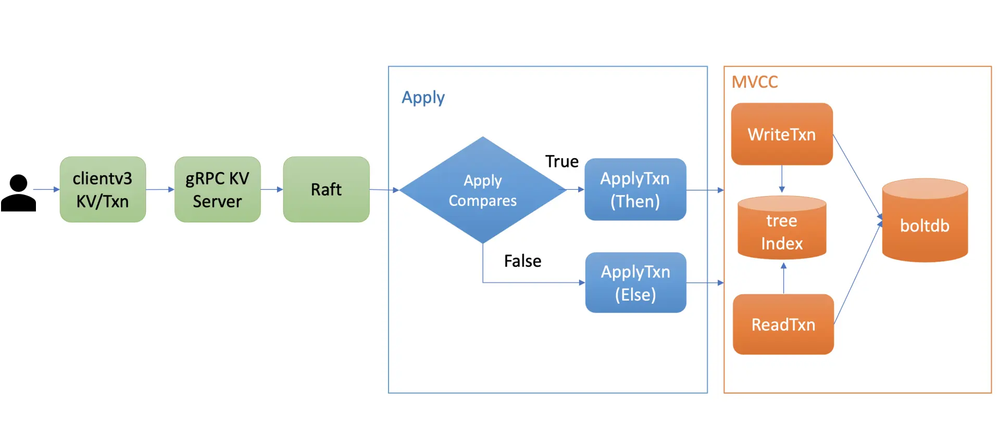

# ETCD

## 安装

etcd 官方文档：https://etcd.io/docs/

安装：https://github.com/etcd-io/etcd/releases/

```
ETCD_VER=v3.5.0

# choose either URL
GOOGLE_URL=https://storage.googleapis.com/etcd
GITHUB_URL=https://github.com/etcd-io/etcd/releases/download
DOWNLOAD_URL=${GOOGLE_URL}

rm -f /tmp/etcd-${ETCD_VER}-darwin-amd64.zip
rm -rf /tmp/etcd-download-test && mkdir -p /tmp/etcd-download-test

curl -L ${DOWNLOAD_URL}/${ETCD_VER}/etcd-${ETCD_VER}-darwin-amd64.zip -o /tmp/etcd-${ETCD_VER}-darwin-amd64.zip
unzip /tmp/etcd-${ETCD_VER}-darwin-amd64.zip -d /tmp && rm -f /tmp/etcd-${ETCD_VER}-darwin-amd64.zip
mv /tmp/etcd-${ETCD_VER}-darwin-amd64/* /tmp/etcd-download-test && rm -rf mv /tmp/etcd-${ETCD_VER}-darwin-amd64

/tmp/etcd-download-test/etcd --version
/tmp/etcd-download-test/etcdctl version
/tmp/etcd-download-test/etcdutl version
mv /tmp/etcd-download-test/etcd /usr/local/bin/
```

安装goreman：

```
go get github.com/mattn/goreman
go install github.com/mattn/goreman
export PATH=$HOME/go/bin:$PATH
```

启动测试集群：修改etcd 源码下的Procfile 文件，将bin/etcd 改为/usr/local/bin/ ; 然后运行 

```
goreman -f Procfile start
```

### 基础架构



- **Client 层**：Client 层包括 client v2 和 v3 两个大版本 API 客户端库，提供了简洁易用的 API，同时支持**负载均衡**、**节点间故障自动转移**，可极大降低业务使用 etcd 复杂度，提升开发效率、服务可用性。

- **API 网络层**：API 网络层主要包括 client 访问 server 和 server 节点之间的通信协议。一方面，client 访问 etcd server 的 API 分为 v2 和 v3 两个大版本。**v2 API 使用 HTTP/1.x 协议，v3 API 使用 gRPC 协议**。同时 v3 通过 etcd grpc-gateway 组件也支持 HTTP/1.x 协议，便于各种语言的服务调用。另一方面，**server 之间通信协议，是指节点间通过 Raft 算法实现数据复制和 Leader 选举等功能时使用的 HTTP 协议**。

- **Raft 算法层**：Raft 算法层**实现了 Leader 选举、日志复制、ReadIndex 等**核心算法特性，用于<font color='blue'>*保障 etcd 多个节点间的数据一致性、提升服务可用性等，是 etcd 的基石和亮点*</font>。

  - ReadIndex 线性读：确保最新的数据已经应用到状态机中(3.1 中引入)；

- **功能逻辑层**：**etcd 核心特性实现层**，如典型的 KVServer 模块、MVCC 模块、Auth 鉴权模块、Lease 租约模块、Compactor 压缩模块等，其中 MVCC 模块主要由 treeIndex 模块和 boltdb 模块组成。

  - Quota: (配额检查) 当 etcd server 收到 put/txn 等写请求的时候，会首先检查下当前 etcd db 大小加上你请求的 key-value 大小之和是否超过了配额（quota-backend-bytes）。如果超过了配额，它会产生一个告警（Alarm）请求，告警类型是 NO SPACE，并通过 Raft 日志同步给其它节点，告知 db 无空间了，并将告警持久化存储到 db 中。Apply 模块在执行每个命令的时候，都会去检查当前是否存在 NO SPACE 告警，如果有则拒绝写入.

  - KVServer 模块: 它需要将 put 写请求内容打包成一个提案消息，提交给 Raft 模块。不过 KVServer 模块在提交提案前，还有如下的一系列检查和限速。

    - Preflight Check: 首先，

      - 如果 Raft 模块已提交的日志索引（committed index）比已应用到状态机的日志索引（applied index）超过了 5000，那么它就返回一个"etcdserver: too many requests"错误给 client。
      - 然后它会尝试去获取请求中的鉴权信息，若使用了密码鉴权、请求中携带了 token，如果 token 无效，则返回"auth: invalid auth token"错误给 client。
      - 其次它会检查你写入的包大小是否超过默认的 1.5MB， 如果超过了会返回"etcdserver: request is too large"错误给给 client。

      

    - Propose: 通过一系列检查之后，会生成一个唯一的 ID，将此请求关联到一个对应的消息通知 channel，然后向 Raft 模块发起（Propose）一个提案（Proposal）。向 Raft 模块发起提案后，KVServer 模块会等待此 put 请求，等待写入结果通过消息通知 channel 返回或者超时。etcd 默认超时时间是 7 秒（5 秒磁盘 IO 延时 +2*1 秒竞选超时时间），如果一个请求超时未返回结果，则可能会出现你熟悉的 etcdserver: request timed out 错误。

  - **Apply 模块**: 

    - 如何异常处理：提交给 Apply 模块执行的提案已获得多数节点确认、持久化，etcd 重启时，会从 WAL 中解析出 Raft 日志条目内容，追加到 Raft 日志的存储中，并重放已提交的日志提案给 Apply 模块执行。etcd 通过引入一个 consistent index 的字段，来存储系统当前已经执行过的日志条目索引，实现幂等性。
    - Apply 模块在执行提案内容前，首先会判断当前提案是否已经执行过了，如果执行了则直接返回，若未执行同时无 db 配额满告警，则进入到 MVCC 模块，开始与持久化存储模块打交道。

  - **MVCC**: 保存一个 key 的多个历史版本, 核心由内存树形索引模块 (treeIndex) 和嵌入式的 KV 持久化存储库 boltdb 组成. 从 treeIndex 中获取 key hello 的版本号，再以版本号作为 boltdb 的 key，从 boltdb 中获取其 value 信息. etcd 的最大版本号 currentRevision。

    - etcd 出于数据一致性、性能等考虑，在访问 boltdb 前，首先会从一个内存读事务 buffer 中，二分查找你要访问 key 是否在 buffer 里面，若命中则直接返回
    - boltdb 里每个 bucket 类似对应 MySQL 一个表，用户的 key 数据存放的 bucket 名字的是 key，etcd MVCC 元数据存放的 bucket 是 meta

  - 

- **存储层**：存储层包含预写日志 (WAL) 模块、快照 (Snapshot) 模块、boltdb 模块。其中 WAL 可保障 etcd crash 后数据不丢失，boltdb 则保存了集群元数据和用户写入的数据。

  - WAL 模块:

    - Raft 模块收到提案后，如果当前节点是 Follower，它会转发给 Leader，只有 Leader 才能处理写请求。Leader 收到提案后，通过 Raft 模块输出待转发给 Follower 节点的消息和待持久化的日志条目，日志条目则封装了我们上面所说的 put hello 提案内容。
    - etcdserver 从 Raft 模块获取到以上消息和日志条目后，作为 Leader，它会将 put 提案消息广播给集群各个节点，同时需要把*集群 Leader 任期号、投票信息、已提交索引、提案内容持久化到一个 WAL（Write Ahead Log）日志文件中*，用于保证集群的一致性、可恢复性.
    - WAL 结构，它由多种类型的 WAL 记录顺序追加写入组成，每个记录由类型、数据、循环冗余校验码组成。不同类型的记录通过 Type 字段区分，Data 为对应记录内容，CRC 为循环校验码信息。
      - WAL 记录类型目前支持 5 种，分别是文件元数据记录、日志条目记录、状态信息记录、CRC 记录、快照记录：
        1. **文件元数据记录**包含节点 ID、集群 ID 信息，它在 WAL 文件创建的时候写入；
        2. **日志条目记录**包含 Raft 日志信息，如 put 提案内容；
        3. **状态信息记录**，包含集群的任期号、节点投票信息等，一个日志文件中会有多条，以最后的记录为准；
        4. **CRC 记录**包含上一个 WAL 文件的最后的 CRC（循环冗余校验码）信息， 在创建、切割 WAL 文件时，作为第一条记录写入到新的 WAL 文件， 用于校验数据文件的完整性、准确性等；
        5. **快照记录**包含快照的任期号、日志索引信息，用于检查快照文件的准确性。
    - WAL 模块持久化 Raft 日志条目: 它首先先将 Raft 日志条目内容（含任期号、索引、提案内容）序列化后保存到 WAL 记录的 Data 字段， 然后计算 Data 的 CRC 值，设置 Type 为 Entry Type， 以上信息就组成了一个完整的 WAL 记录。

    


etcd 是典型的读多写少存储; 


### Etcd 写流程：



​	当 client 发起一个更新 hello 为 world 请求后，若 Leader 收到写请求，它会将此请求持久化到 WAL 日志，并广播给各个节点，若**一半以上**节点持久化成功，则该请求对应的日志条目被标识为已提交，etcdserver 模块异步从 Raft 模块获取已提交的日志条目，应用到**状态机** (boltdb 等)。

​	此时若 client 发起一个读取 hello 的请求，假设此请求直接从状态机中读取， 如果连接到的是 C 节点，若 C 节点磁盘 I/O 出现波动，可能导致它应用已提交的日志条目很慢，则会出现更新 hello 为 world 的写命令，在 client 读 hello 的时候还未被提交到状态机，因此就可能读取到旧数据; 所以会出现两种场景：

- **串行** (Serializable) 读，它具有低延时、高吞吐量的特点，适合对**数据一致性要求不高**的场景。(所以不会经过线性读中的3、4 两步骤)
- **线性**读(默认)：它需要经过 Raft 协议模块，反应的是集群共识，因此在延时和吞吐量上相比串行读略差一点，适用于对**数据一致性要求高**的场景。

### Etcd 线性读流程：




### Raft 协议算法:

- **全同步复制**是指主收到一个写请求后，必须等待全部从节点确认返回后，才能返回给客户端成功。因此如果一个从节点故障，整个系统就会不可用。这种方案为了保证多副本的一致性，而牺牲了可用性，一般使用不多。
- **异步复制**是指主收到一个写请求后，可及时返回给 client，异步将请求转发给各个副本，若还未将请求转发到副本前就故障了，则可能导致数据丢失，但是可用性是最高的。
- **半同步复制**介于全同步复制、异步复制之间，它是指主收到一个写请求后，**至少**有一个副本接收数据后，就可以返回给客户端成功，在数据一致性、可用性上实现了平衡和取舍。
- **去中心化复制**是指在一个 n 副本节点集群中，任意节点都可接受写请求，但一个成功的写入需要 w 个节点确认，读取也必须查询

#### Leader 选举：

​	Raft 协议中它定义了集群中的如下节点状态，任何时刻，每个节点肯定处于其中一个状态：

- Follower，跟随者， 同步从 Leader 收到的日志，etcd 启动的时候默认为此状态；
- Candidate，竞选者，可以发起 Leader 选举；
- Leader，集群领导者， 唯一性，拥有同步日志的特权，需定时广播心跳给 Follower 节点，以维持领导者身份。

**Leader crash 后 Follower 如何精选：**

​    正常情况下，Leader 节点会按照心跳间隔时间，定时广播心跳消息（MsgHeartbeat 消息）给 Follower 节点，以维持 Leader 身份。 Follower 收到后回复心跳应答包消息（MsgHeartbeatResp 消息）给 Leader。当 Follower 节点接收 Leader 节点心跳消息超时后（etcd 默认心跳间隔时间（heartbeat-interval）是 100ms， 默认竞选超时时间（election timeout）是 1000ms），它会转变成 Candidate 节点，进入 Candidate 状态的节点，会立即发起选举流程，自增任期号，投票给自己，并向其他节点发送竞选 Leader 投票消(MsgVote)，若获得集群多数节点的支持后，它就可转变成 Leader 节点。

​	任期号（term）：用连续的整数表示，集群发生新的选举，任期号会单调递增。通过任期号，可以比较各个节点的数据新旧、识别过期的 Leader 等，它在 Raft 算法中充当逻辑时钟的作用。

​	其他Follower节点B 收到 该Candidate 节点C 竞选 Leader 消息后，这时候可能会出现如下两种情况：

1. 第一种情况是 C 节点判断 B 节点的数据至少和自己一样新、B 节点任期号大于 C 当前任期号、并且 C 未投票给其他候选者，就可投票给 B。这时 B 节点获得了集群多数节点支持，于是成为了新的 Leader。
2. 第二种情况是，恰好 C 也心跳超时超过竞选时间了，它也发起了选举，并投票给了自己，那么它将拒绝投票给 B，这时谁也无法获取集群多数派支持，只能等待竞选超时，开启新一轮选举。Raft 为了优化选票被瓜分导致选举失败的问题，引入了随机数，每个节点等待发起选举的时间点不一致，优雅的解决了潜在的竞选活锁，同时易于理解。

**如何避免无效的选举：**

​	在 etcd 3.4 中，etcd 引入了一个 PreVote 参数（默认 false），可以用来启用 PreCandidate 状态解决此问题，Follower 在转换成 Candidate 状态前，先**进入 PreCandidate 状态，不自增任期号，** **发起预投票**。若获得集群多数节点认可，确定有概率成为 Leader 才能进入 Candidate 状态，发起选举流程。


#### 日志复制： 





​	Leader 会维护两个核心字段来追踪各个 Follower 的进度信息，一个字段是 NextIndex， 它表示 Leader 发送给 Follower 节点的下一个日志条目索引。一个字段是 MatchIndex， 它表示 Follower 节点已复制的最大日志条目的索引。 Raft 模块输入是 Msg 消息，输出是一个 Ready 结构，它包含待持久化的日志条目、发送给 peer 节点的消息、已提交的日志条目内容、线性查询结果等 Raft 输出核心信息。

​	etcdserver 模块通过 channel 从 Raft 模块获取到 Ready 结构后（流程图中的序号 3 流程），因 B 节点是 Leader，它首先会通过基于 HTTP 协议的网络模块将追加日志条目消息（MsgApp）广播给 Follower，并同时将待持久化的日志条目持久化到 WAL 文件中（流程图中的序号 4 流程），最后将日志条目追加到稳定的 Raft 日志存储中（流程图中的序号 5 流程）。

​	各个 Follower 收到追加日志条目（MsgApp）消息，并通过安全检查后，它会持久化消息到 WAL 日志中，并将消息追加到 Raft 日志存储，随后会向 Leader 回复一个应答追加日志条目（MsgAppResp）的消息，告知 Leader 当前已复制的日志最大索引（流程图中的序号 6 流程）。Leader 收到应答追加日志条目（MsgAppResp）消息后，会将 Follower 回复的已复制日志最大索引更新到跟踪 Follower 进展的 Match Index 字段，如下面的日志图 2 中的 Follower C MatchIndex 为 6，Follower A 为 5，日志图 2 描述的是 hello 日志条目提交后的各节点 Raft 日志状态。

​	最后 Leader 根据 Follower 的 MatchIndex 信息，计算出一个位置，如果这个位置已经被**一半以上**节点持久化，那么这个位置之前的日志条目都可以被标记为已提交。Leader 可通过在发送心跳消息（MsgHeartbeat）给 Follower 节点时，告知它已经提交的日志索引位置。

​	最后各个节点的 etcdserver 模块，可通过 channel 从 Raft 模块获取到已提交的日志条目（流程图中的序号 7 流程），应用日志条目内容到存储状态机（流程图中的序号 8 流程），返回结果给 client。

动画演示：http://kailing.pub/raft/index.html


### 鉴权：

#### 	认证：

​	 etcd 实现了两种认证机制，分别是密码认证和证书认证。



​	当对应的 Raft 日志条目被集群半数以上节点确认后，Apply 模块通过鉴权存储 (AuthStore) 模块，执行日志条目的内容，将规则存储到 boltdb 的一系列“鉴权表”里面。通过认证后，在访问 MVCC 模块之前，还需要通过授权流程。授权的目的是检查 client 是否有权限操作你请求的数据路径，etcd 实现了 RBAC 机制，支持为每个用户分配一个角色，为每个角色授予最小化的权限。

##### **密码认证：**

使用高安全性 hash 函数（Blowfish encryption algorithm）、随机的加盐 salt、可自定义的 hash 值计算迭代次数 cost

```shell
$ etcdctl user add root:rootUser // 创建一个 root 账号，它拥有集群的最高读写权限
root created
$ etcdctl auth enable // 开启鉴权
Authentication Enabled
```

​	**etcd server 鉴权时机：**etcd server 收到 put hello 请求的时候，在提交到 Raft 模块前，它会从你请求的上下文中获取你的用户身份信息。如果你未通过认证，那么在状态机应用 put 命令的时候，检查身份权限的时候发现是空，就会返回此错误给 client。

​	**账号创建过程**：鉴权模块收到 etcdctl user add test:test 此命令后，它会使用 bcrpt 库的 blowfish 算法，基于明文密码、随机分配的 salt、自定义的 cost、迭代多次计算得到一个 hash 值，并将加密算法版本、salt 值、cost、hash 值组成一个字符串，作为加密后的密码。最后，鉴权模块将用户名 alice 作为 key，用户名、加密后的密码作为 value，存储到 boltdb 的 authUsers bucket 里面，完成一个账号创建。

​	**提升密码认证性能：**当 etcd server 验证用户密码成功后，它就会返回一个 **Token** 字符串给 client，用于表示用户的身份。后续请求携带此 Token，就无需再次进行密码校验，实现了通信证的效果。（etcd 目前支持两种 Token，分别为 Simple Token 和 JWT Token）

- **Simple Token**：核心原理是当一个用户身份验证通过后，**生成一个随机的字符串值 Token 返回给 client**，并在内存中使用 map 存储用户和 Token 映射关系。当收到用户的请求时， etcd 会从请求中获取 Token 值，转换成对应的用户名信息，返回给下层模块使用。
  - 如何防止Token 泄漏不安全：通过给每个 Token 设置一个过期时间 TTL 属性，Token 过期后 client 需再次验证身份，减小泄漏时间窗口。
  - 缺点：Simple Token 字符串本身并未含任何有价值信息，client 无法通过 Token 获取到过期时间、用户名、签发者等信息。所以 client 不容易提前去规避因 Token 失效导致的请求报错。

- **JWT Token**（Json Web Token）：它是一个基于 JSON 的开放标准（RFC 7519）定义的一种紧凑、独立的格式，可用于在身份提供者和服务提供者间，传递被认证的用户身份信息。它由 Header、Payload、Signature 三个对象组成， 每个对象都是一个 JSON 结构体。
  - Header：包含 **alg** 和 **typ** 两个字段，alg 表示签名的算法，etcd 支持 RSA、ESA、PS 系列，typ 表示类型就是 JWT。
  - Payload：它表示载荷，包含用户名、过期时间等信息，可以自定义添加字段。
  - Signature(签名)：它将 header、payload 使用 base64 url 编码，然后将编码后的字符串用"."连接在一起，最后用选择的签名算法比如 RSA 系列的私钥对其计算签名，输出结果即是 Signature。

##### 证书认证:

​	HTTPS 是利用非对称加密实现身份认证和密钥协商，因此使用 HTTPS 协议的时候，你需要使用 CA 证书给 client 生成证书才能访问。client 证书它含有证书版本、序列号、签名算法、签发者、有效期、主体名等信息。在 etcd 中，如果你使用了 HTTPS 协议并启用了 client 证书认证 (--client-cert-auth)，它会取 **CN 字段作为用户名**。


#### 授权：

​	开启鉴权后，put 请求命令在应用到状态机前，etcd 还会对发出此请求的用户进行权限检查， 判断其是否有权限操作请求的数据。常用的权限控制方法有 ACL(Access Control List)、ABAC(Attribute-based access control)、RBAC(Role-based access control)，etcd 实现的是 RBAC 机制。

- RBAC (基于角色权限的控制系统) : 
  - 由 User(用户)、Role(角色)、Permission(权限) 三部分组成；
  - 目前支持三种权限，分别是 READ、WRITE、READWRITE。
  - etcd 为了提升权限检查的性能，引入了区间树，检查用户操作的 key 是否在已授权的区间，时间复杂度仅为 O(logN)。

```shell
$ #创建一个admin role 
etcdctl role add admin  --user root:root
Role admin created
# #分配一个可读写[hello，helly]范围数据的权限给admin role
$ etcdctl role grant-permission admin readwrite hello helly --user root:root
Role admin updated
# 将用户alice和admin role关联起来，赋予admin权限给user
$ etcdctl user grant-role alice admin --user root:root
Role admin is granted to user alice
```


### 租约（Lease）:

保证同一时刻只有一个能对外提供服务, 基于主动型上报模式，提供的一种活性检测机制.

实现活性（liveness）检测主要有两种方案。

- 方案一为被动型检测，你可以通过探测节点定时拨测 Leader 节点，看是否健康，比如 Redis Sentinel。
- 方案二为主动型上报，Leader 节点可定期向协调服务发送"特殊心跳"汇报健康状态，若其未正常发送心跳，并超过和协调服务约定的最大存活时间后，就会被协调服务移除 Leader 身份标识。同时其他节点可通过协调服务，快速感知到 Leader 故障了，进而发起新的选举。

client 和 etcd server 之间存在一个约定，内容是 etcd server 保证在约定的有效期内（TTL），不会删除关联到此 Lease 上的 key-value。若未在有效期内续租，那么 etcd server 就会删除 Lease 和其关联的 key-value。



etcd 在启动的时候，创建 Lessor 模块的时候，它会启动两个常驻 goroutine，如上图所示，一个是 RevokeExpiredLease 任务，定时检查是否有过期 Lease，发起撤销过期的 Lease 操作。一个是 CheckpointScheduledLease，定时触发更新 Lease 的剩余到期时间的操作。

Lessor 模块提供了 Grant、Revoke、LeaseTimeToLive、LeaseKeepAlive API 给 client 使用，各接口作用如下:

- Grant 表示创建一个 TTL 为你指定秒数的 Lease，Lessor 会将 Lease 信息持久化存储在 boltdb 中；
- Revoke 表示撤销 Lease 并删除其关联的数据；
- LeaseTimeToLive 表示获取一个 Lease 的有效期、剩余时间；
- LeaseKeepAlive 表示为 Lease 续期。	

#### 租约创建：

```shell
# 创建一个TTL为600秒的lease，etcd server返回LeaseID
$ etcdctl lease grant 600
lease 326975935f48f814 granted with TTL(600s)

# 查看lease的TTL、剩余时间
$ etcdctl lease timetolive 326975935f48f814
lease 326975935f48f814 granted with TTL(600s)， remaining(590s)
```

​	当 Lease server 收到 client 的创建一个有效期 600 秒的 Lease 请求后，会通过 **Raft 模块**完成日志同步，随后 **Apply 模块**通过 Lessor 模块的 Grant 接口执行日志条目内容。首先 Lessor 的 Grant 接口会把 Lease 保存到内存的 ItemMap 数据结构中，然后它需要持久化 Lease，将 Lease 数据保存到 **boltdb** 的 Lease bucket 中，返回一个唯一的 LeaseID 给 client。

#### 租约关联到node：

​	KV 模块的 API 接口提供了一个"**--lease**"参数，可以通过如下命令，将 key node 关联到对应的 LeaseID 上。然后查询的时候增加 **-w** 参数输出格式为 json，就可查看到 key 关联的 LeaseID。

​	通过 put 等命令新增一个指定了"--lease"的 key 时，**MVCC 模块**它会通过 Lessor 模块的 **Attach** 方法，将 key 关联到 Lease 的 key 内存集合 **ItemSet** 中。MVCC 模块在持久化存储 key-value 的时候，保存到 boltdb 的 value 是个结构体（mvccpb.KeyValue）， 它不仅包含 key-value 数据，还包含了**关联的 LeaseID** 等信息。因此当 etcd 重启时，可根据此信息，重建关联各个 Lease 的 key 集合列表。（*一个 Lease 关联的 key 集合是保存在内存中的*）

```shell
$ etcdctl put node healthy --lease 326975935f48f818
OK
$ etcdctl get node -w=json | python -m json.tool
{
    "kvs":[
        {
            "create_revision":24，
            "key":"bm9kZQ=="，
            "Lease":3632563850270275608，
            "mod_revision":24，
            "value":"aGVhbHRoeQ=="，
            "version":1
        }
    ]
}
```

#### 租约续期：

​	核心是将 Lease 的过期时间更新为当前系统时间加其 TTL。

​	优化：

​		一方面不同 key 若 TTL 相同，可复用同一个 Lease， 显著减少了 Lease 数。

​		另一方面，通过 gRPC HTTP/2 实现了多路复用，流式传输，同一连接可支持为多个 Lease 续期，大大减少了连接数。

#### 租约淘汰：

​	淘汰过期 Lease 的工作由 Lessor 模块的一个异步 goroutine 负责。它会定时从**最小堆**中取出已过期的 Lease，执行删除 Lease 和其关联的 key 列表数据的 **RevokeExpiredLease** 任务。（每次新增 Lease、续期的时候，它会插入、更新一个对象到最小堆中，对象含有 LeaseID 和其到期时间 unixnano，对象之间按到期时间升序排序。这样每次只需轮询、检查排在前面的 Lease 过期时间，一旦轮询到未过期的 Lease， 则可结束本轮检查。）

​	Lessor 主循环每隔 **500ms** 执行一次撤销 Lease 检查（**RevokeExpiredLease**），每次轮询堆顶的元素，若已过期则加入到待淘汰列表，直到堆顶的 Lease 过期时间大于当前，则结束本轮轮询。

​	通知Follower 节点：Lessor 模块会将已确认过期的 LeaseID，保存在一个名为 expiredC 的 channel 中，而 etcd server 的主循环会定期从 channel 中获取 LeaseID，发起 **revoke 请求**，通过 Raft Log 传递给 Follower 节点。各个节点收到 revoke Lease 请求后，获取关联到此 Lease 上的 key 列表，从 boltdb 中删除 key，从 Lessor 的 **Lease map** 内存中删除此 Lease 对象，最后还需要从 boltdb 的 Lease bucket 中删除这个 Lease。

#### checkpoint 机制：

​	**起因**：若较频繁出现 Leader 切换，切换时间小于 Lease 的 TTL，这会导致 Lease 永远无法删除，大量 key 堆积，db 大小超过配额等异常。

​	**措施**：通过**CheckPointScheduledLeases **的任务：

​		一方面，etcd 启动的时候，Leader 节点后台会运行此异步任务，定期批量地将 Lease 剩余的 TTL 基于 Raft Log 同步给 Follower 节点，Follower 节点收到 CheckPoint 请求后，更新内存数据结构 LeaseMap 的剩余 TTL 信息。

​		另一方面，当 Leader 节点收到 KeepAlive 请求的时候，它也会通过 checkpoint 机制把此 Lease 的剩余 TTL 重置，并同步给 Follower 节点，尽量确保续期后集群各个节点的 Lease 剩余 TTL 一致性。

> lease是leader在内存中维护过期最小堆的，因此续期操作client是必须要直接发送给leader的，如果follower节点收到了keepalive请求，会转发给leader节点。续期操作不经过raft协议处理同步，而leaseGrant/Revoke请求会经过raft协议同步给各个节点，因此任意节点都可以处理它。
>
> 淘汰过期lease最小堆中保存的时间是lease到期时间，比如lease TTL是600秒/10分钟，当前时间是00:00:00, 那么到期时间00:10:00。


### MVCC：

​	Multiversion concurrency control 多版本控制并发；MVCC 机制正是基于多版本技术实现的一种**乐观锁机制**，它乐观地认为数据不会发生冲突，但是当事务**提交时**，具备检测数据是否冲突的能力。

​	更新一个 key-value 数据的时候，它并**不会直接覆盖原数据，而是新增一个版本来存储新的数据**，每个数据都有一个版本号。版本号它是一个逻辑时间。当指定版本号读取数据时，它实际上访问的是版本号生成那个时间点的快照数据。当你删除数据的时候，它实际也是新增一条带删除标识的数据记录。

```shell
# 更新key hello为world1
$ etcdctl put hello world1
OK
# 通过指定输出模式为json,查看key hello更新后的详细信息
$ etcdctl get hello -w=json
{
    "kvs":[
        {
            "key":"aGVsbG8=",
            "create_revision":2,
            "mod_revision":2, # 表示 key 最后一次修改时的 etcd 版本号
            "version":1,
            "value":"d29ybGQx"
        }
    ],
    "count":1
}
# 再次修改key hello为world2
$ etcdctl put hello world2
OK
# 确认修改成功,最新值为wolrd2
$ etcdctl get hello
hello
world2
# 指定查询版本号,获得了hello上一次修改的值
$ etcdctl get hello --rev=2
hello
world1
# 删除key hello
$ etcdctl del  hello
1
# 删除后指定查询版本号3,获得了hello删除前的值
$ etcdctl get hello --rev=3
hello
world2
```

​	**读写流程**：

​	

- treeIndex 模块基于内存版 B-tree 实现了 key 索引管理，它保存了用户 key 与版本号（revision）的映射关系等信息。
- Backend 模块负责 etcd 的 key-value 持久化存储，基于boltdb 实现, 主要由 ReadTx、BatchTx、Buffer 组成，ReadTx 定义了抽象的读事务接口，BatchTx 在 ReadTx 之上定义了抽象的写事务接口，Buffer 是数据缓存区。 (boltdb 是一个基于 B+ tree 实现的、支持事务的 key-value 嵌入式数据库)

etcd 保存用户 key 与版本号映射关系的数据结构 B-tree，为什么 etcd 使用它而不使用哈希表、平衡二叉树？

- 特性上分析: 因 etcd 支持范围查询，因此保存索引的数据结构也必须支持范围查询才行。所以哈希表不适合，而 B-tree 支持范围查询。
- 性能上分析: 平横二叉树每个节点只能容纳一个数据、导致树的高度较高，而 B-tree 每个节点可以容纳多个数据，树的高度更低，更扁平，涉及的查找次数更少，具有优越的增、删、改、查性能。


### Watch:

#### 轮询 vs 流式推送：

- 在 etcd v2 Watch 机制实现中，使用的是 HTTP/1.x 协议，实现简单、兼容性好，每个 watcher 对应一个 TCP 连接。client 通过 HTTP/1.1 协议长连接定时轮询 server，获取最新的数据变化事件。（大量轮询会产生一定的 QPS，server 端会消耗大量的 socket、内存等资源）

- 在 etcd v3 中，为了解决 etcd v2 的以上缺陷，使用的是基于 HTTP/2 的 gRPC 协议，双向流的 Watch API 设计，实现了连接多路复用。

  - HTTP/2 协议为什么能实现多路复用呢？
    - 在 HTTP/2 协议中，HTTP 消息被分解独立的帧（Frame），交错发送，帧是最小的数据单位。每个帧会标识属于哪个流（Stream），流由多个数据帧组成，每个流拥有一个唯一的 ID，一个数据流对应一个请求或响应包。HTTP/2 可基于帧的流 ID 将并行、交错发送的帧重新组装成完整的消息。

  - 基于 HTTP/2 协议，实现了一个 client/TCP 连接支持多 gRPC Stream， 一个 gRPC Stream 又支持多个 watcher。同时事件通知模式也从 client 轮询优化成 server 流式推送，极大降低了 server 端 socket、内存等资源。

> 当 watch 连接的节点故障，clientv3 库支持自动重连到健康节点，并使用之前已接收的最大版本号创建新的 watcher，避免旧事件回放等。

#### 滑动窗口 vs MVCC：

- 滑动窗口是**仅**保存**有限的**最近历史版本到**内存**中。
  - 使用一个环形数组来存储历史事件版本，当 key 被修改后，相关事件就会被添加到数组中来。若超过 eventQueue 的容量，则淘汰最旧的事件。
- MVCC 机制则将历史版本保存在磁盘中，避免了历史版本的丢失，极大的提升了 Watch 机制的可靠性。
  - 将一个 key 的历史修改版本保存在 boltdb 里面。boltdb 是一个基于磁盘文件的持久化存储，因此它重启后历史事件不像 etcd v2 一样会丢失，同时可通过配置压缩策略，来控制保存的历史版本数。

> 版本号是 etcd 逻辑时钟，当 client 因网络等异常出现连接闪断后，通过版本号，它就可从 server 端的 boltdb 中获取错过的历史事件，而无需全量同步，它是 etcd Watch 机制数据增量同步的核心

#### 推送机制：

​	**synced watcher**: 表示此类 watcher 监听的数据都已经同步完毕，在等待新的变更。

​	**unsynced watcher**: 表示此类 watcher 监听的数据还未同步完成，落后于当前最新数据变更，正在努力追赶。


- ###### watch 请求：

  1. etcd 的 gRPCWatchServer 收到 watch 请求后，会创建一个 serverWatchStream, 它负责接收 client 的 gRPC Stream 的 create/cancel watcher 请求 (recvLoop goroutine)，并将从 MVCC 模块接收的 Watch 事件转发给 client(sendLoop goroutine)。

  2. 当 serverWatchStream 收到 create watcher 请求后，serverWatchStream 会调用 MVCC 模块的 WatchStream 子模块分配一个 watcher id，并将 watcher 注册到 MVCC 的 WatchableKV 模块。

  3. 在 etcd 启动的时候，WatchableKV 模块会运行 syncWatchersLoop 和 syncVictimsLoop goroutine，分别负责不同场景下的事件推送。

     **syncVictimsLoop:** 负责 slower watcher 的**堆积**的事件推送。

     - 它会遍历 victim watcherBatch 数据结构，尝试将堆积的事件再次推送到 watcher 的接收 channel 中。若推送失败，则再次加入到 victim watcherBatch 数据结构中等待下次重试。
     - 若推送成功，watcher 监听的最小版本号 (minRev) 小于等于 server 当前版本号 (currentRev)，说明可能还有历史事件未推送，需加入到 unsynced watcherGroup 中，由**历史事件推送机制**，推送 minRev 到 currentRev 之间的事件。
     - 若 watcher 的最小版本号大于 server 当前版本号，则加入到 synced watcher 集合中，进入下面**最新事件通知机制**(即put 请求)。

     **syncWatchersLoop:** 负责 unsynced watcherGroup 中的 watcher **历史**事件推送。

     - 它会遍历处于 unsynced watcherGroup 中的每个 watcher，为了优化性能，它会选择一批 unsynced watcher 批量同步，找出这一批 unsynced watcher 中监听的最小版本号。

     - 因 boltdb 的 key 是按版本号存储的，因此可通过指定查询的 key 范围的最小版本号作为开始区间，当前 server 最大版本号作为结束区间，遍历 boltdb 获得所有历史数据。

     - 然后将 KeyValue 结构转换成事件，匹配出监听过事件中 key 的 watcher 后，将事件发送给对应的 watcher 事件接收 channel 即可。发送完成后，watcher 从 unsynced watcherGroup 中移除、添加到 synced watcherGroup 中。

     - 若 watcher 监听的版本号已经小于当前 etcd server 压缩的版本号，历史变更数据就可能已丢失，因此 etcd server 会返回 ErrCompacted 错误给 client。client 收到此错误后，需重新获取数据最新版本号后，再次 Watch。

       

     

- ###### put 请求：

  1. 当 etcd 收到一个写请求, 请求经过 KVServer、Raft 模块后 Apply 到状态机时，在 MVCC 的 put 事务中，它会将本次修改的后的 mvccpb.KeyValue 保存到一个 changes 数组中。
  2. 在 put 事务结束时，它会将 KeyValue 转换成 Event 事件，然后回调 watchableStore.notify 函数（流程 5）。notify 会匹配出监听过此 key 并处于 synced watcherGroup 中的 watcher，同时事件中的版本号要大于等于 watcher 监听的最小版本号，才能将事件发送到此 watcher 的事件 channel 中。
  3. serverWatchStream 的 sendLoop goroutine 监听到 channel 消息后，读出消息立即推送给 client（流程 6 和 7），至此，完成一个最新修改事件推送。

- ###### 重试机制:

  - 若出现 channel buffer 满了，etcd 为了保证 Watch 事件的高可靠性，并不会丢弃它，而是将此 watcher 从 synced watcherGroup 中删除，然后将此 watcher 和事件列表保存到一个名为受害者 victim 的 watcherBatch 结构中，通过异步机制重试保证事件的可靠性。

- ###### 事件匹配：

  1. 当收到创建 watcher 请求的时候，它会把 watcher 监听的 key 范围插入到下面的区间树中，区间的值保存了监听同样 key 范围的 watcher 集合 /watcherSet。
  2. 当产生一个事件时，etcd 首先需要从 map 查找是否有 watcher 监听了单 key，其次它还需要从区间树找出与此 key 相交的所有区间，然后从区间的值获取监听的 watcher 集合。
  3. 区间树支持快速查找一个 key 是否在某个区间内，时间复杂度 O(LogN)，因此 etcd 基于 map 和区间树实现了 watcher 与事件快速匹配，具备良好的扩展性。


​	

### 事物：

- etcd v2 的时候， etcd 提供了 CAS（Compare and swap），然而其只支持单 key，不支持多 key。
- etcd v3 为了解决多 key 的原子操作问题，提供了全新迷你事务 API，同时基于 MVCC 版本号，它可以实现各种隔离级别的事务。事务 API 由 If 语句、Then 语句、Else 语句组成。



通过 client 发起一个 txn 事务操作时，通过 gRPC KV Server、Raft 模块处理后，在 Apply 模块执行此事务的时候，它首先对你的事务的 If 语句进行检查，也就是 ApplyCompares 操作，如果通过此操作，则执行 ApplyTxn/Then 语句，否则执行 ApplyTxn/Else 语句。会根据事务是否只读、可写，通过 MVCC 层的读写事务对象，执行事务中的 get/put/delete 各操作，也就是 MVCC 对 key 的读写原理。

```shell
$ etcdctl txn -i
compares: //对应If语句
value("Alice") = "200" //判断Alice账号资金是否为200

success requests (get, put, del): //对应Then语句
put Alice 100 //Alice账号初始资金200减100
put Bob 300 //Bob账号初始资金200加100

failure requests (get, put, del): //对应Else语句
get Alice  
get Bob

SUCCESS

OK
OK
```

#### ACID 特性:

- 原子性（Atomicity）：指在一个事务中，所有请求要么同时成功，要么同时失败。
- 一致性（Consistency）：指事务变更前后，数据库必须满足若干恒等条件的状态约束。
- 隔离性（Isolation）：指事务在执行过程中的可见性。
- 持久性（Durability）：指事务一旦提交，其所做的修改会永久保存在数据库。


### boltdb：

- boltdb 文件指的是你 etcd 数据目录下的 member/snap/db 的文件；
- etcd 启动的时候，会通过 mmap 机制将 db 文件映射到内存，后续可从内存中快速读取文件中的数据。写请求通过 fwrite 和 fdatasync 来写入、持久化数据到磁盘。


page 按照功能可分为元数据页 (meta page)、B+ tree 索引节点页 (branch page)、B+ tree 叶子节点页 (leaf page)、空闲页管理页 (freelist page)、空闲页 (free page)。文件最开头的两个 page 是固定的 db 元数据 meta page(在 client 调用 boltdb Open API 时被填充的)，空闲页管理页记录了 db 中哪些页是空闲、可使用的。索引节点页保存了 B+ tree 的内部节点.

```go
// 往 key bucket 写入一个 key 为 r94，value 为 world 的字符串
// 打开boltdb文件，获取db对象
db,err := bolt.Open("db"， 0600， nil)
if err != nil {
   log.Fatal(err)
}
defer db.Close()
// 参数true表示创建一个写事务，false读事务
tx,err := db.Begin(true)
if err != nil {
   return err
}
defer tx.Rollback()
// 使用事务对象创建key bucket
b,err := tx.CreatebucketIfNotExists([]byte("key"))
if err != nil {
   return err
}
// 使用bucket对象更新一个key
if err := b.Put([]byte("r94"),[]byte("world")); err != nil {
   return err
}
// 提交事务
if err := tx.Commit(); err != nil {
   return err
}
```

#### page 磁盘页结构:

- 由页 ID(id)、页类型 (flags)、数量 (count)、溢出页数量 (overflow)、页面数据起始位置 (ptr) 字段组成。
- 页类型 (flags)目前有如下四种：0x01 表示 branch page，0x02 表示 leaf page，0x04 表示 meta page，0x10 表示 freelist page。
- 数量字段仅在页类型为 leaf 和 branch 时生效，溢出页数量是指当前页面数据存放不下，需要向后再申请 overflow 个连续页面使用，页面数据起始位置指向 page 的载体数据，比如 meta page、branch/leaf 等 page 的内容。

#### meta page 数据结构：

- 由 boltdb 的文件标识 (magic)、版本号 (version)、页大小 (pagesize)、boltdb 的根 bucket 信息 (root bucket)、freelist 页面 ID(freelist)、总的页面数量 (pgid)、上一次写事务 ID(txid)、校验码 (checksum) 组成。
- 第 0、1 页我们知道它是固定存储 db 元数据的页 (meta page)。


### 数据压缩：

- 时间周期性压缩
  - auto-compaction-mode 为 periodic 时，它表示启用时间周期性压缩，auto-compaction-retention 为保留的时间的周期，比如 1h。（auto-compaction-retention 为'0'时，将关闭自动压缩策略）
- 版本号压缩
  - auto-compaction-mode 为 revision 时，它表示启用版本号压缩模式，auto-compaction-retention 为保留的历史版本号数，比如 10000。


**执行流程：**

1. 通过 API 发起一个 Compact 请求后，KV Server 收到 Compact 请求提交到 Raft 模块处理，在 Raft 模块中提交后，Apply 模块就会通过 MVCC 模块的 Compact 接口执行此压缩任务。
2. Compact 接口首先会更新当前 server 已压缩的版本号，并将耗时昂贵的压缩任务保存到 FIFO 队列中异步执行。压缩任务执行时，它首先会压缩 treeIndex 模块中的 keyIndex 索引，其次会遍历 boltdb 中的 key，删除已废弃的 key。

> 压缩的本质是回收历史版本，目标对象仅是历史版本，不包括一个 key-value 数据的最新版本
>

通过 boltdb 删除大量的 key，在事务提交后 B+ tree 经过分裂、平衡，会释放出若干 branch/leaf page 页面，然而 boltdb 并不会将其释放给磁盘，freelist 会记录哪些页是空闲的。调整 db 大小操作是昂贵的，会对性能有较大的损害。


