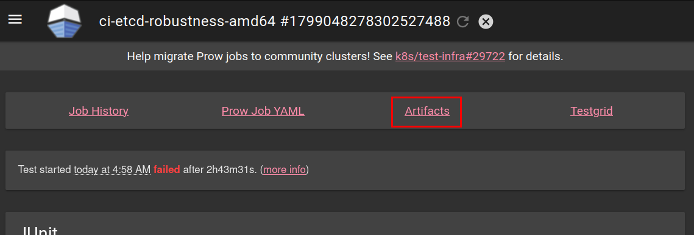
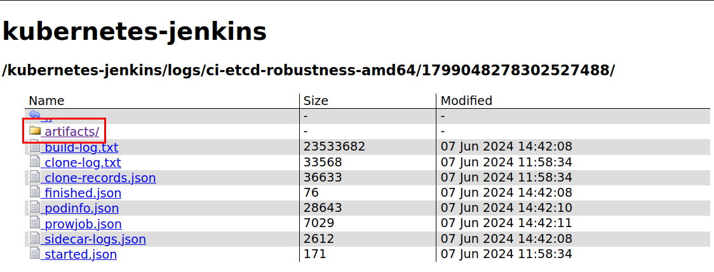
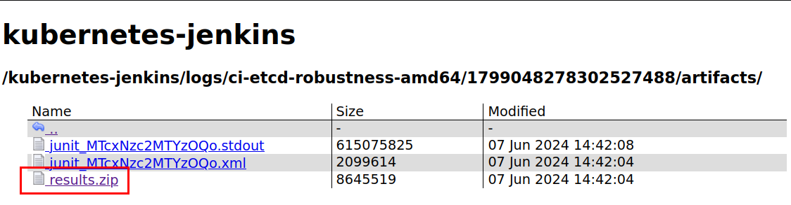
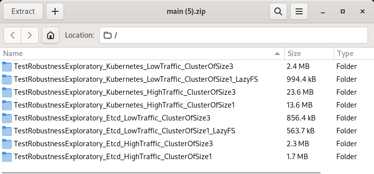
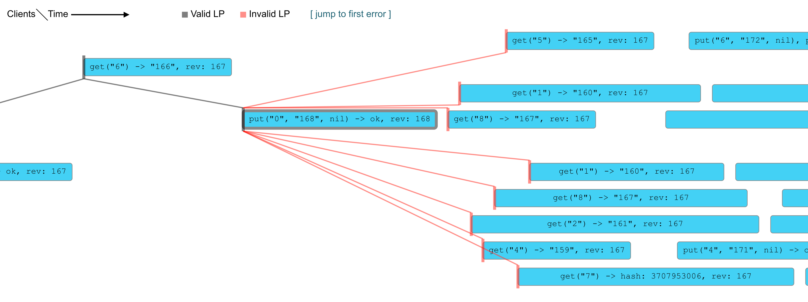

# etcd Robustness Testing

This document describes the robustness testing framework for etcd, a distributed key-value store.
The purpose of these tests is to rigorously validate that etcd maintains its [KV API guarantees] and [watch API guarantees] under a wide range of conditions and failures.

[KV API guarantees]: https://etcd.io/docs/v3.6/learning/api_guarantees/#kv-apis
[watch API guarantees]: https://etcd.io/docs/v3.6/learning/api_guarantees/#watch-apis

## Robustness track record

| Correctness / Consistency issue                                              | Report     | Introduced in     | Discovered by   | Reproducible by robustness test                   | Command                             |
| -----------------------------------------------------------------            | ---------- | ----------------- | --------------- | ------------------------------------------------- | ----------------------------------- |
| Inconsistent revision caused by crash during high load [#13766]              | Mar 2022   | v3.5              | User            | Yes, report preceded robustness tests             | `make test-robustness-issue13766`   |
| Single node cluster can loose a write on crash [#14370]                      | Aug 2022   | v3.4 or earlier   | User            | Yes, report preceded robustness tests             | `make test-robustness-issue14370`   |
| Enabling auth can lead to inconsistency [#14571]                             | Oct 2022   | v3.4 or earlier   | User            | No, authorization is not covered.                 |                                     |
| Inconsistent revision caused by crash during defrag [#14685]                 | Nov 2022   | v3.5              | Robustness      | Yes, after covering defragmentation.              | `make test-robustness-issue14685`   |
| Watch progress notification not synced with steam [#15220]                   | Jan 2023   | v3.4 or earlier   | User            | Yes, after covering watch progress notification   |                                     |
| Watch traveling back in time after network partition [#15271]                | Feb 2023   | v3.4 or earlier   | Robustness      | Yes, after covering network partitions            | `make test-robustness-issue15271`   |
| Duplicated watch event due to bug in TXN caching [#17247]                    | Jan 2024   | main branch       | Robustness      | Yes, prevented regression in v3.6                 |                                     |
| Watch events lost during stream starvation [#17529]                          | Mar 2024   | v3.4 or earlier   | User            | Yes, after covering of slow watch                 | `make test-robustness-issue17529`   |
| Revision decreasing caused by crash during compaction [#17780]               | Apr 2024   | v3.4 or earlier   | Robustness      | Yes, after covering compaction                    |                                     |
| Watch dropping an event when compacting on delete [#18089]                   | May 2024   | v3.4 or earlier   | Robustness      | Yes, after covering of compaction                 | `make test-robustness-issue18089`   |
| Inconsistency when reading compacted revision in TXN [#18667]                | Oct 2024   | v3.4 or earlier   | User            |                                                   |                                     |
| Missing delete event on watch opened on same revision as compaction [#19179] | Jan 2025   | v3.4 or earlier   | Robustness      | Yes, after covering of compaction                 | `make test-robustness-issue19179`   |

[#13766]: https://github.com/etcd-io/etcd/issues/13766
[#14370]: https://github.com/etcd-io/etcd/issues/14370
[#14571]: https://github.com/etcd-io/etcd/issues/14571
[#14685]: https://github.com/etcd-io/etcd/pull/14685
[#15220]: https://github.com/etcd-io/etcd/issues/15220
[#15271]: https://github.com/etcd-io/etcd/issues/15271
[#17247]: https://github.com/etcd-io/etcd/issues/17247
[#17529]: https://github.com/etcd-io/etcd/issues/17529
[#17780]: https://github.com/etcd-io/etcd/issues/17780
[#18089]: https://github.com/etcd-io/etcd/issues/18089
[#18667]: https://github.com/etcd-io/etcd/issues/18667
[#19179]: https://github.com/etcd-io/etcd/issues/19179


## How Robustness Tests Work

Robustness tests compare the etcd cluster behavior against a simplified model of its expected behavior.
These tests cover various scenarios, including:

* **Different etcd cluster setups:** Cluster sizes, configurations, and deployment topologies.
* **Client traffic types:**  Variety of key-value operations (puts, ranges, transactions) and watch patterns.
* **Failures:** Network partitions, node crashes, disk failures, and other disruptions.

**Test Procedure:**

1. **Cluster Creation:**  A new etcd cluster is created with the specified configuration.
2. **Traffic and Failures:** Client traffic is generated and sent to the cluster while failures are injected.
3. **History Collection:** All client operations and their results are recorded.
4. **Validation:** The collected history is validated against the etcd model and a set of validators to ensure consistency and correctness.
5. **Report Generation:**  If a failure is detected then a detailed report is generated to help diagnose the issue.
   This report includes information about the client operations and etcd data directories.

## Key Concepts

### Distributed System Terminology

*   **Consensus:** A process where nodes in a distributed system agree on a single data value. Etcd uses the Raft algorithm to achieve consensus.
*   **Strict vs Eventual consistency:**
    *   **Strict Consistency:** All components see the same data at the same time after an update.
    *   **Eventual Consistency:** Components may temporarily see different data after an update but converge to the same view eventually.
*   **Consistency Models (https://jepsen.io/consistency)**
    *   **Single-Object Consistency Models:**
        *   **Sequential Consistency:** A strong single-object model. Operations appear to take place in some total order, consistent with the order of operations on each individual process.
        *   **Linearizable Consistency:** The strongest single-object model. Operations appear to happen instantly and in order, consistent with real-time ordering.
    *   **Transactional Consistency Models**
        *   **Serializable Consistency:** A transactional model guaranteeing that transactions appear to occur in some total order. Operations within a transaction are atomic and do not interleave with other transactions. It's a multi-object property, applying to the entire system, not just individual objects.
        *   **Strict Serializable Consistency:** The strongest transactional model. Combines the total order of serializability with the real-time ordering constraints of linearizability.

Etcd provides strict serializability for KV operations and eventual consistency for Watch.

**Etcd Guarantees**

*   **Key-value API operations** https://etcd.io/docs/latest/learning/api_guarantees/#kv-apis
*   **Watch API guarantees** https://etcd.io/docs/latest/learning/api_guarantees/#watch-apis

### Kubernetes Integration

*   **[Implicit Kubernetes-ETCD Contract]:**  Defines how Kubernetes uses etcd to store cluster state.
*   **ResourceVersion:**  A string used by Kubernetes to track resource versions, corresponding to etcd revisions.
*   **Sharding resource types:** Kubernetes treats each resource type as a totally independent entity.
    It allows sharding each resource type into a separate etcd cluster.

[Implicit Kubernetes-ETCD Contract]: https://docs.google.com/document/d/1NUZDiJeiIH5vo_FMaTWf0JtrQKCx0kpEaIIuPoj9P6A/edit?usp=sharing

## Running locally 

1. Build etcd with failpoints
    ```bash
    make gofail-enable
    make build
    make gofail-disable
    ```
2. Run the tests
    ```bash
    make test-robustness
    ```
   
    Optionally, you can pass environment variables:
    * `GO_TEST_FLAGS` - to pass additional arguments to `go test`. 
      It is recommended to run tests multiple times with failfast enabled. this can be done by setting `GO_TEST_FLAGS='--count=100 --failfast'`.
    * `EXPECT_DEBUG=true` - to get logs from the cluster.
    * `RESULTS_DIR` - to change the location where the results report will be saved.
    * `PERSIST_RESULTS` - to persist the results report of the test. By default this will not be persisted in the case of a successful run.

## Re-evaluate existing report

Robustness test validation is constantly changing and improving.
Errors in the etcd model could be causing false positives, which makes the ability to re-evaluate the reports after we fix the issue important.

> Note: Robustness test report format is not stable, and it's expected that not all old reports can be re-evaluated using the newest version.

1. Identify the location of the robustness test report.

   > Note: By default robustness test report is only generated for failed test.

   * **For local runs:** this would be by identifying log line, in the following example that would be `/tmp/TestRobustnessExploratory_Etcd_HighTraffic_ClusterOfSize1`:
      ```
      logger.go:146: 2024-04-08T09:45:27.734+0200 INFO    Saving robustness test report   {"path": "/tmp/TestRobustnessExploratory_Etcd_HighTraffic_ClusterOfSize1"}
      ```

   * **For remote runs on CI:** you need to go to the [Prow Dashboard](https://testgrid.k8s.io/sig-etcd-robustness#Summary), go to a build, download one of the Artifacts (`artifacts/results.zip`), and extract it locally.

     

     

     

     Each directory will be prefixed by `TestRobustness` each containing a robustness test report.

     

     Pick one of the directories within the archive corresponding to the failed test scenario.
     The largest directory by size usually corresponds to the failed scenario.
     If you are not sure, you may check which scenario failed in the test logs.

2. Copy the robustness report directory into the `testdata` directory.

   The `testdata` directory can contain multiple robustness test reports.
   The name of the report directory doesn't matter, as long as it's unique to prevent clashing with reports already present in `testdata` directory.
   For example, the path for `history.html` file could look like `$REPO_ROOT/tests/robustness/testdata/v3.5_failure_24_April/history.html`.

3. Run `make test-robustness-reports` to validate all reports in the `testdata` directory.

## Analysing failure

If robustness tests fail, we want to analyse the report to confirm if the issue is on etcd side. The location of the directory with the report
is mentioned in the `Saving robustness test report` log. Logs from report generation should look like:
```
    logger.go:146: 2024-05-08T10:42:54.429+0200 INFO    Saving robustness test report   {"path": "/tmp/TestRobustnessRegression_Issue14370/1715157774429416550"}
    logger.go:146: 2024-05-08T10:42:54.429+0200 INFO    Saving member data dir  {"member": "TestRobustnessRegressionIssue14370-test-0", "path": "/tmp/TestRobustnessRegression_Issue14370/1715157774429416550/server-TestRobustnessRegressionIssue14370-test-0"}
    logger.go:146: 2024-05-08T10:42:54.430+0200 INFO    no watch operations for client, skip persisting {"client-id": 1}
    logger.go:146: 2024-05-08T10:42:54.430+0200 INFO    Saving operation history        {"path": "/tmp/TestRobustnessRegression_Issue14370/1715157774429416550/client-1/operations.json"}
    logger.go:146: 2024-05-08T10:42:54.430+0200 INFO    Saving watch operations {"path": "/tmp/TestRobustnessRegression_Issue14370/1715157774429416550/client-2/watch.json"}
    logger.go:146: 2024-05-08T10:42:54.431+0200 INFO    no KV operations for client, skip persisting    {"client-id": 2}
    logger.go:146: 2024-05-08T10:42:54.431+0200 INFO    no watch operations for client, skip persisting {"client-id": 3}
    logger.go:146: 2024-05-08T10:42:54.431+0200 INFO    Saving operation history        {"path": "/tmp/TestRobustnessRegression_Issue14370/1715157774429416550/client-3/operations.json"}
    logger.go:146: 2024-05-08T10:42:54.433+0200 INFO    no watch operations for client, skip persisting {"client-id": 4}
    logger.go:146: 2024-05-08T10:42:54.433+0200 INFO    Saving operation history        {"path": "/tmp/TestRobustnessRegression_Issue14370/1715157774429416550/client-4/operations.json"}
    logger.go:146: 2024-05-08T10:42:54.434+0200 INFO    no watch operations for client, skip persisting {"client-id": 5}
    logger.go:146: 2024-05-08T10:42:54.434+0200 INFO    Saving operation history        {"path": "/tmp/TestRobustnessRegression_Issue14370/1715157774429416550/client-5/operations.json"}
    logger.go:146: 2024-05-08T10:42:54.435+0200 INFO    no watch operations for client, skip persisting {"client-id": 6}
    logger.go:146: 2024-05-08T10:42:54.435+0200 INFO    Saving operation history        {"path": "/tmp/TestRobustnessRegression_Issue14370/1715157774429416550/client-6/operations.json"}
    logger.go:146: 2024-05-08T10:42:54.437+0200 INFO    no watch operations for client, skip persisting {"client-id": 7}
    logger.go:146: 2024-05-08T10:42:54.437+0200 INFO    Saving operation history        {"path": "/tmp/TestRobustnessRegression_Issue14370/1715157774429416550/client-7/operations.json"}
    logger.go:146: 2024-05-08T10:42:54.438+0200 INFO    no watch operations for client, skip persisting {"client-id": 8}
    logger.go:146: 2024-05-08T10:42:54.438+0200 INFO    Saving operation history        {"path": "/tmp/TestRobustnessRegression_Issue14370/1715157774429416550/client-8/operations.json"}
    logger.go:146: 2024-05-08T10:42:54.439+0200 INFO    no watch operations for client, skip persisting {"client-id": 9}
    logger.go:146: 2024-05-08T10:42:54.439+0200 INFO    Saving operation history        {"path": "/tmp/TestRobustnessRegression_Issue14370/1715157774429416550/client-9/operations.json"}
    logger.go:146: 2024-05-08T10:42:54.440+0200 INFO    no watch operations for client, skip persisting {"client-id": 10}
    logger.go:146: 2024-05-08T10:42:54.440+0200 INFO    Saving operation history        {"path": "/tmp/TestRobustnessRegression_Issue14370/1715157774429416550/client-10/operations.json"}
    logger.go:146: 2024-05-08T10:42:54.441+0200 INFO    Saving visualization    {"path": "/tmp/TestRobustnessRegression_Issue14370/1715157774429416550/history.html"}
```

The report follows the hierarchy:
* `server-*` - etcd server data directories, can be used to verify disk/memory corruption.
  * `member`
    * `wal` - Write Ahead Log (WAL) directory, that can be analysed using `etcd-dump-logs` command line tool available in `tools` directory.
    * `snap` - Snapshot directory, includes the bbolt database file `db`, that can be analysed using `etcd-dump-db` command line tool available in `tools` directory.
* `client-*` - Client request and response dumps in json format.
  * `watch.json` - Watch requests and responses, can be used to validate [watch API guarantees].
  * `operations.json` - KV operation history
* `history.html` - Visualization of KV operation history, can be used to validate [KV API guarantees].

### Example analysis of a linearization issue

Let's reproduce and analyse robustness test report for issue [#14370].
To reproduce the issue by yourself run `make test-robustness-issue14370`.
After a couple of tries robustness tests should fail with a log `Linearization failed` and save the report locally.

Example:
```
    logger.go:146: 2024-05-08T10:42:53.379+0200 INFO    Validating linearizable operations      {"timeout": "5m0s"}
    logger.go:146: 2024-05-08T10:42:54.429+0200 ERROR   Linearization failed    {"duration": "1.050105973s"}
    validate.go:39: Failed linearization, skipping further validation
    logger.go:146: 2024-05-08T10:42:54.429+0200 INFO    Saving robustness test report   {"path": "/tmp/TestRobustnessRegression_Issue14370/1715157774429416550"}
    ...
    logger.go:146: 2024-05-08T10:42:54.441+0200 INFO    Saving visualization    {"path": "/tmp/TestRobustnessRegression_Issue14370/1715157774429416550/history.html"}
```

Linearization issues are easiest to analyse via history visualization.
Open `/tmp/TestRobustnessRegression_Issue14370/1715157774429416550/history.html` file in your browser.
Jump to the error in linearization by clicking `[ jump to first error ]` on the top of the page.

You should see a graph similar to the one on the image below.


The last correct request (connected with the grey line) is a `Put` request that succeeded and got revision `168`.
All following requests are invalid (connected with red line) as they have revision `167`. 
Etcd guarantees that revision is non-decreasing, so this shows a bug in etcd as there is no way revision should decrease.
This is consistent with the root cause of [#14370] as it was an issue with the process crash causing the last write to be lost.

[#14370]: https://github.com/etcd-io/etcd/issues/14370

### Example analysis of a watch issue

Let's reproduce and analyse robustness test report for issue [#15271].
To reproduce the issue by yourself run `make test-robustness-issue15271`.
After a couple of tries robustness tests should fail with a logs `Broke watch guarantee` and save report locally.

Example:
```
    logger.go:146: 2024-05-08T10:50:11.301+0200 INFO    Validating linearizable operations      {"timeout": "5m0s"}
    logger.go:146: 2024-05-08T10:50:15.754+0200 INFO    Linearization success   {"duration": "4.453346487s"}
    logger.go:146: 2024-05-08T10:50:15.754+0200 INFO    Validating watch
    logger.go:146: 2024-05-08T10:50:15.849+0200 ERROR   Broke watch guarantee   {"guarantee": "ordered", "client": 4, "revision": 3}
    validate.go:45: Failed validating watch history, err: broke Ordered - events are ordered by revision; an event will never appear on a watch if it precedes an event in time that has already been posted
    logger.go:146: 2024-05-08T10:50:15.849+0200 INFO    Validating serializable operations
    logger.go:146: 2024-05-08T10:50:15.866+0200 INFO    Saving robustness test report   {"path": "/tmp/TestRobustnessRegression_Issue15271/1715158215866033806"}
```

Watch issues are easiest to analyse by reading the recorded watch history.

Watch history is recorded for each client separated in different subdirectory under `/tmp/TestRobustnessRegression_Issue15271/1715158215866033806`.

Open `watch.json` for the client mentioned in the log `Broke watch guarantee`.
For client `4` that broke the watch guarantee open `/tmp/TestRobustnessRegression_Issue15271/1715158215866033806/client-4/watch.json`.

Each line consists of json blob corresponding to a single watch request sent by the client.
Look for events with `Revision` equal to revision mentioned in the first log with `Broke watch guarantee`, in this case, look for `"Revision":3,`.
You should see watch responses where the `Revision` decreases like ones below:
```
{"Events":[{"Type":"put-operation","Key":"key5","Value":{"Value":"793","Hash":0},"Revision":799,"IsCreate":false,"PrevValue":null}],"IsProgressNotify":false,"Revision":799,"Time":3202907249,"Error":""}
{"Events":[{"Type":"put-operation","Key":"key4","Value":{"Value":"1","Hash":0},"Revision":3,"IsCreate":true,"PrevValue":null}, ...
```

Up to the first response, the `Revision` of events only increased up to a value of `799`.
However, the following line includes an event with `Revision` equal `3`.
If you follow the `revision` throughout the file you should notice that watch replayed revisions for a second time.
This is incorrect and breaks `Ordered` [watch API guarantees].
This is consistent with the root cause of [#14370] where the member reconnecting to cluster will resend revisions.

[#15271]: https://github.com/etcd-io/etcd/issues/15271
