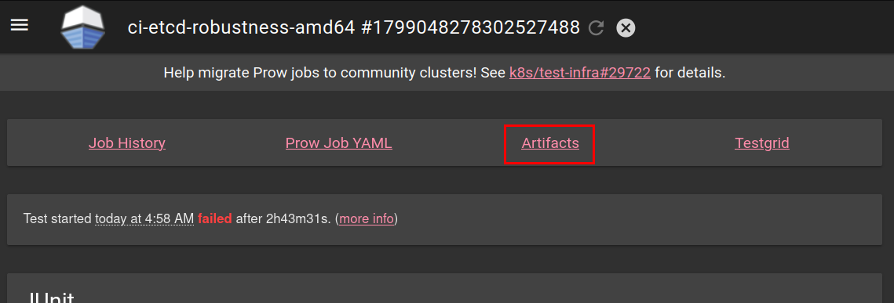
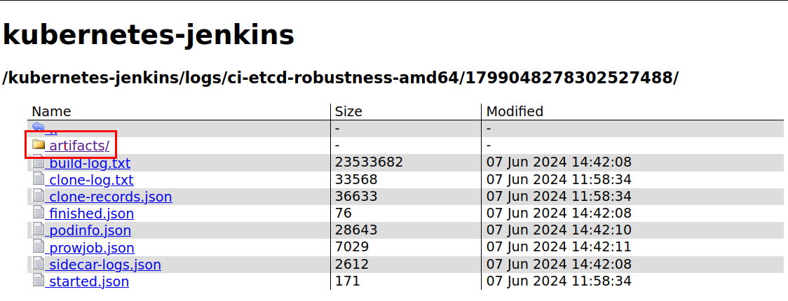
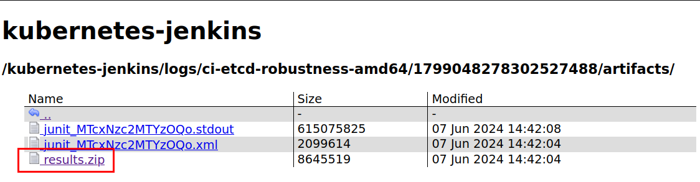
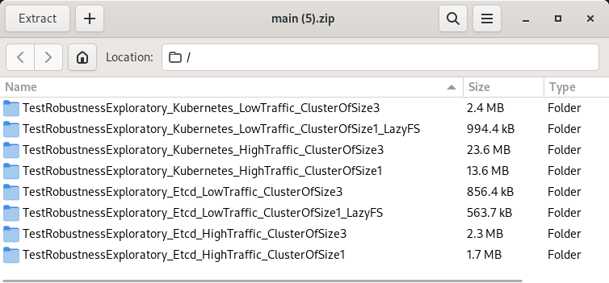

# etcd Robustness Testing

Purpose of etcd robustness tests is to validate that etcd upholds
[KV API guarantees] and [watch API guarantees] under any condition or failure.

Robustness tests achieve that comparing etcd cluster behavior against a simplified model.
Multiple test encompass different etcd cluster setups, client traffic types and failures experienced by cluster.
During a single test we create a cluster and inject failures while sending and recording client traffic.
Correctness is validated by running collected history of client operations against the etcd model and a set of validators.
Upon failure tests generate a report that can be used to attribute whether failure was caused by bug in etcd or test framework. 

[KV API guarantees]: https://etcd.io/docs/v3.6/learning/api_guarantees/#kv-apis
[watch API guarantees]: https://etcd.io/docs/v3.6/learning/api_guarantees/#watch-apis

## Running locally 

1. Build etcd with failpoints
    ```bash
    make gofail-enable
    make build
    make gofail-disable
    ```
2. Run the tests

    ```bash
    make test-robustness
    ```
   
    Optionally you can pass environment variables:
    * `GO_TEST_FLAGS` - to pass additional arguments to `go test`. 
      It is recommended to run tests multiple times with failfast enabled. this can be done by setting `GO_TEST_FLAGS='--count=100 --failfast'`.
    * `EXPECT_DEBUG=true` - to get logs from the cluster.
    * `RESULTS_DIR` - to change location where results report will be saved.
    * `PERSIST_RESULTS` - to persist the results report of the test. By default this will not be persisted in the case of a successful run.

## Re-evaluate existing report

Robustness test validation is constantly changing and improving.
Errors in etcd model could be causing false positives, which makes the ability to re-evaluate the reports after we fix the issue important.

> Note: Robustness test report format is not stable, and it's expected that not all old reports can be re-evaluated using the newest version.

1. Identify location of the robustness test report.

   > Note: By default robustness test report is only generated for failed test.

   * **For local runs:** this would be by identifying log line, in the following example that would be `/tmp/TestRobustnessExploratory_Etcd_HighTraffic_ClusterOfSize1`:
      ```
      logger.go:146: 2024-04-08T09:45:27.734+0200 INFO    Saving robustness test report   {"path": "/tmp/TestRobustnessExploratory_Etcd_HighTraffic_ClusterOfSize1"}
      ```

   * **For remote runs on CI:** you need to go to the [Prow Dashboard](https://prow.k8s.io/job-history/gs/kubernetes-jenkins/logs/ci-etcd-robustness-amd64), go to a build, download one of the Artifacts (`artifacts/results.zip`), and extract it locally.

     

     

     

     Each directory will be prefixed by `TestRobustness` each containing a robustness test report.

     

     Pick one of the directories within the archive corresponding to the failed test scenario.
     The largest directory by size usually corresponds to the failed scenario.
     If you are not sure, you may check which scenario failed in the test logs.

2. Copy the robustness report directory into the `testdata` directory.

   The `testdata` directory can contain multiple robustness test reports.
   The name of the report directory doesn't matter, as long as it's unique to prevent clashing with reports already present in `testdata` directory.
   For example path for `history.html` file could look like `$REPO_ROOT/tests/robustness/testdata/v3.5_failure_24_April/history.html`.

3. Run `make test-robustness-reports` to validate all reports in the `testdata` directory.

## Analysing failure

If robustness tests fails we want to analyse the report to confirm if the issue is on etcd side. Location of the directory with the report
is mentioned `Saving robustness test report` log. Logs from report generation should look like:
```
    logger.go:146: 2024-05-08T10:42:54.429+0200 INFO    Saving robustness test report   {"path": "/tmp/TestRobustnessRegression_Issue14370/1715157774429416550"}
    logger.go:146: 2024-05-08T10:42:54.429+0200 INFO    Saving member data dir  {"member": "TestRobustnessRegressionIssue14370-test-0", "path": "/tmp/TestRobustnessRegression_Issue14370/1715157774429416550/server-TestRobustnessRegressionIssue14370-test-0"}
    logger.go:146: 2024-05-08T10:42:54.430+0200 INFO    no watch operations for client, skip persisting {"client-id": 1}
    logger.go:146: 2024-05-08T10:42:54.430+0200 INFO    Saving operation history        {"path": "/tmp/TestRobustnessRegression_Issue14370/1715157774429416550/client-1/operations.json"}
    logger.go:146: 2024-05-08T10:42:54.430+0200 INFO    Saving watch operations {"path": "/tmp/TestRobustnessRegression_Issue14370/1715157774429416550/client-2/watch.json"}
    logger.go:146: 2024-05-08T10:42:54.431+0200 INFO    no KV operations for client, skip persisting    {"client-id": 2}
    logger.go:146: 2024-05-08T10:42:54.431+0200 INFO    no watch operations for client, skip persisting {"client-id": 3}
    logger.go:146: 2024-05-08T10:42:54.431+0200 INFO    Saving operation history        {"path": "/tmp/TestRobustnessRegression_Issue14370/1715157774429416550/client-3/operations.json"}
    logger.go:146: 2024-05-08T10:42:54.433+0200 INFO    no watch operations for client, skip persisting {"client-id": 4}
    logger.go:146: 2024-05-08T10:42:54.433+0200 INFO    Saving operation history        {"path": "/tmp/TestRobustnessRegression_Issue14370/1715157774429416550/client-4/operations.json"}
    logger.go:146: 2024-05-08T10:42:54.434+0200 INFO    no watch operations for client, skip persisting {"client-id": 5}
    logger.go:146: 2024-05-08T10:42:54.434+0200 INFO    Saving operation history        {"path": "/tmp/TestRobustnessRegression_Issue14370/1715157774429416550/client-5/operations.json"}
    logger.go:146: 2024-05-08T10:42:54.435+0200 INFO    no watch operations for client, skip persisting {"client-id": 6}
    logger.go:146: 2024-05-08T10:42:54.435+0200 INFO    Saving operation history        {"path": "/tmp/TestRobustnessRegression_Issue14370/1715157774429416550/client-6/operations.json"}
    logger.go:146: 2024-05-08T10:42:54.437+0200 INFO    no watch operations for client, skip persisting {"client-id": 7}
    logger.go:146: 2024-05-08T10:42:54.437+0200 INFO    Saving operation history        {"path": "/tmp/TestRobustnessRegression_Issue14370/1715157774429416550/client-7/operations.json"}
    logger.go:146: 2024-05-08T10:42:54.438+0200 INFO    no watch operations for client, skip persisting {"client-id": 8}
    logger.go:146: 2024-05-08T10:42:54.438+0200 INFO    Saving operation history        {"path": "/tmp/TestRobustnessRegression_Issue14370/1715157774429416550/client-8/operations.json"}
    logger.go:146: 2024-05-08T10:42:54.439+0200 INFO    no watch operations for client, skip persisting {"client-id": 9}
    logger.go:146: 2024-05-08T10:42:54.439+0200 INFO    Saving operation history        {"path": "/tmp/TestRobustnessRegression_Issue14370/1715157774429416550/client-9/operations.json"}
    logger.go:146: 2024-05-08T10:42:54.440+0200 INFO    no watch operations for client, skip persisting {"client-id": 10}
    logger.go:146: 2024-05-08T10:42:54.440+0200 INFO    Saving operation history        {"path": "/tmp/TestRobustnessRegression_Issue14370/1715157774429416550/client-10/operations.json"}
    logger.go:146: 2024-05-08T10:42:54.441+0200 INFO    Saving visualization    {"path": "/tmp/TestRobustnessRegression_Issue14370/1715157774429416550/history.html"}
```

Report follows the hierarchy:
* `server-*` - etcd server data directories, can be used to verify disk/memory corruption.
  * `member`
    * `wal` - Write Ahead Log (WAL) directory, that can be analysed using `etcd-dump-logs` command line tool available in `tools` directory.
    * `snap` - Snapshot directory, includes the bbolt database file `db`, that can be analysed using `etcd-dump-db` command line tool available in `tools` directory.
* `client-*` - Client request and response dumps in json format.
  * `watch.jon` - Watch requests and responses, can be used to validate [watch API guarantees].
  * `operations.json` - KV operation history
* `history.html` - Visualization of KV operation history, can be used to validate [KV API guarantees].

### Example analysis of linearization issue

Let's reproduce and analyse robustness test report for issue [#14370].
To reproduce the issue by yourself run `make test-robustness-issue14370`.
After a couple of tries robustness tests should fail with a log `Linearization failed` and save report locally.

Example:
```
    logger.go:146: 2024-05-08T10:42:53.379+0200 INFO    Validating linearizable operations      {"timeout": "5m0s"}
    logger.go:146: 2024-05-08T10:42:54.429+0200 ERROR   Linearization failed    {"duration": "1.050105973s"}
    validate.go:39: Failed linearization, skipping further validation
    logger.go:146: 2024-05-08T10:42:54.429+0200 INFO    Saving robustness test report   {"path": "/tmp/TestRobustnessRegression_Issue14370/1715157774429416550"}
    ...
    logger.go:146: 2024-05-08T10:42:54.441+0200 INFO    Saving visualization    {"path": "/tmp/TestRobustnessRegression_Issue14370/1715157774429416550/history.html"}
```

Linearization issues are easiest to analyse via history visualization.
Open `/tmp/TestRobustnessRegression_Issue14370/1715157774429416550/history.html` file in your browser.
Jump to the error in linearization by clicking `[ jump to first error ]` on the top of the page.

You should see a graph similar to the one on the image below.


Last correct request (connected with grey line) is a `Put` request that succeeded and got revision `168`.
All following requests are invalid (connected with red line) as they have revision `167`. 
Etcd guarantee that revision is non-decreasing, so this shows a bug in etcd as there is no way revision should decrease.
This is consistent with the root cause of [#14370] as it was issue with process crash causing last write to be lost.

[#14370]: https://github.com/etcd-io/etcd/issues/14370

### Example analysis of watch issue

Let's reproduce and analyse robustness test report for issue [#15271].
To reproduce the issue by yourself run `make test-robustness-issue15271`.
After a couple of tries robustness tests should fail with a logs `Broke watch guarantee` and save report locally.

Example:
```
    logger.go:146: 2024-05-08T10:50:11.301+0200 INFO    Validating linearizable operations      {"timeout": "5m0s"}
    logger.go:146: 2024-05-08T10:50:15.754+0200 INFO    Linearization success   {"duration": "4.453346487s"}
    logger.go:146: 2024-05-08T10:50:15.754+0200 INFO    Validating watch
    logger.go:146: 2024-05-08T10:50:15.849+0200 ERROR   Broke watch guarantee   {"guarantee": "ordered", "client": 4, "revision": 3}
    validate.go:45: Failed validating watch history, err: broke Ordered - events are ordered by revision; an event will never appear on a watch if it precedes an event in time that has already been posted
    logger.go:146: 2024-05-08T10:50:15.849+0200 INFO    Validating serializable operations
    logger.go:146: 2024-05-08T10:50:15.866+0200 INFO    Saving robustness test report   {"path": "/tmp/TestRobustnessRegression_Issue15271/1715158215866033806"}
```

Watch issues are easiest to analyse by reading the recorded watch history.
Watch history is recorded for each client separated in different subdirectory under `/tmp/TestRobustnessRegression_Issue15271/1715158215866033806`
Open `watch.json` for client mentioned in log `Broke watch guarantee`.
For client `4` that broke the watch guarantee open `/tmp/TestRobustnessRegression_Issue15271/1715158215866033806/client-4/watch.json`.

Each line consists of json blob corresponding to single watch request sent by client.
Look for events with `Revision` equal to revision mentioned in the first log with `Broke watch guarantee`, in this case look for `"Revision":3,`.
You should see watch responses where the `Revision` decreases like ones below:
```
{"Events":[{"Type":"put-operation","Key":"key5","Value":{"Value":"793","Hash":0},"Revision":799,"IsCreate":false,"PrevValue":null}],"IsProgressNotify":false,"Revision":799,"Time":3202907249,"Error":""}
{"Events":[{"Type":"put-operation","Key":"key4","Value":{"Value":"1","Hash":0},"Revision":3,"IsCreate":true,"PrevValue":null}, ...
```

Up to the first response the `Revision` of events only increased up to a value of `799`.
However, the following line includes an event with `Revision` equal `3`.
If you follow the `revision` throughout the file you should notice that watch replayed revisions second time.
This is incorrect and breaks `Ordered` [watch API guarantees].
This is consistent with the root cause of [#14370] where member reconnecting to cluster will resend revisions.

[#15271]: https://github.com/etcd-io/etcd/issues/15271
