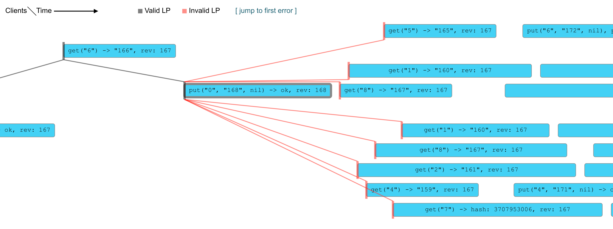

# etcd Robustness Testing

Purpose of etcd robustness tests is to validate that etcd upholds
[KV API guarantees] and [watch API guarantees] under any condition or failure.

Robustness tests achieve that comparing etcd cluster behavior against a simplified model.
Multiple test encompass different etcd cluster setups, client traffic types and failures experienced by cluster.
During a single test we create a cluster and inject failures while sending and recording client traffic.
Correctness is validated by running collected history of client operations against the etcd model and a set of validators.
Upon failure tests generate a report that can be used to attribute whether failure was caused by bug in etcd or test framework. 

[KV API guarantees]: https://etcd.io/docs/v3.6/learning/api_guarantees/#kv-apis
[watch API guarantees]: https://etcd.io/docs/v3.6/learning/api_guarantees/#watch-apis

## Running locally 

1. Build etcd with failpoints
    ```bash
    make gofail-enable
    make build
    make gofail-disable
    ```
2. Run the tests

    ```bash
    make test-robustness
    ```
   
    Optionally you can pass environment variables:
    * `GO_TEST_FLAGS` - to pass additional arguments to `go test`. 
      It is recommended to run tests multiple times with failfast enabled. this can be done by setting `GO_TEST_FLAGS='--count=100 --failfast'`.
    * `EXPECT_DEBUG=true` - to get logs from the cluster.
    * `RESULTS_DIR` - to change location where results report will be saved.

## Analysing failure

If robustness tests fails we want to analyse the report to confirm if the issue is on etcd side. Location of this report
is included in test logs. One of log lines should look like:
```
    history.go:34: Model is not linearizable
    logger.go:130: 2023-03-18T12:18:03.244+0100 INFO    Saving member data dir  {"member": "TestRobustnessIssue14370-test-0", "path": "/tmp/TestRobustness_Issue14370/TestRobustnessIssue14370-test-0"}
    logger.go:130: 2023-03-18T12:18:03.244+0100 INFO    Saving watch responses  {"path": "/tmp/TestRobustness_Issue14370/TestRobustnessIssue14370-test-0/responses.json"}
    logger.go:130: 2023-03-18T12:18:03.247+0100 INFO    Saving watch events     {"path": "/tmp/TestRobustness_Issue14370/TestRobustnessIssue14370-test-0/events.json"}
    logger.go:130: 2023-05-15T17:42:37.792+0200 INFO    Saving operation history        {"path": "/tmp/TestRobustness_ClusterOfSize3_Kubernetes/client-1/operations.json"}
    logger.go:130: 2023-05-15T17:42:37.793+0200 INFO    Saving watch responses  {"path": "/tmp/TestRobustness_ClusterOfSize3_Kubernetes/client-2/watch.json"}
    logger.go:130: 2023-03-18T12:18:03.256+0100 INFO    Saving visualization    {"path": "/tmp/TestRobustness_Issue14370/history.html"}
```

Report includes multiple types of files:
* Member db files, can be used to verify disk/memory corruption.
* Watch responses saved as json, can be used to validate [watch API guarantees].
* Operation history saved as both html visualization and a json, can be used to validate [KV API guarantees].

### Example analysis of linearization issue

Let's reproduce and analyse robustness test report for issue [#14370].
To reproduce the issue by yourself run `make test-robustness-issue14370`.
After a couple of tries robustness tests should fail with a log `Model is not linearizable` and save report locally.

Lineralization issues are easiest to analyse via history visualization. 
Open `/tmp/TestRobustness_Issue14370/history.html` file in your browser.
Jump to the error in linearization by clicking `[ jump to first error ]` on the top of the page.

You should see a graph similar to the one on the image below.


Last correct request (connected with grey line) is a `Put` request that succeeded and got revision `168`.
All following requests are invalid (connected with red line) as they have revision `167`. 
Etcd guarantee that revision is non-decreasing, so this shows a bug in etcd as there is no way revision should decrease.
This is consistent with the root cause of [#14370] as it was issue with process crash causing last write to be lost.

[#14370]: https://github.com/etcd-io/etcd/issues/14370

### Example analysis of watch issue

Let's reproduce and analyse robustness test report for issue [#15271].
To reproduce the issue by yourself run `make test-robustness-issue15271`.
After a couple of tries robustness tests should fail with a logs `Broke watch guarantee` and save report locally.

Watch issues are easiest to analyse by reading the recorded watch history.
Watch history is recorded for each client separated in different subdirectory under `/tmp/TestRobustness_Issue15271/`
Open `watch.json` for client mentioned in log `Broke watch guarantee`.
For example for client `14` open `/tmp/TestRobustness_Issue15271/client-14/watch.json`.

Each line consists of json blob corresponding to single watch response observed by client.
Look for lines with `mod_revision` equal to revision mentioned in the first log with `Broke watch guarantee`
You should see two lines where the `mod_revision` decreases like ones below:
```
{"Events":[{"Op":{"Type":"put","Key":"5","WithPrefix":false,"Limit":0,"Value":{"Value":"357","Hash":0},"LeaseID":0},"Revision":335}],"IsProgressNotify":false,"Revision":335,"Time":1050415777}
{"Events":[{"Op":{"Type":"put","Key":"1","WithPrefix":false,"Limit":0,"Value":{"Value":"24","Hash":0},"LeaseID":0},"Revision":24}, ...
```

Up to the first line the `revision` of events within responses only increased up to a value of `335`.
However, the following line includes an event with `revision` equal `24`.
If you follow the `revision` throughout the file you should notice that watch replayed revisions second time.
This is incorrect and breaks `Ordered` and `Unique` [watch API guarantees].
This is consistent with the root cause of [#14370] where member reconnecting to cluster will incorrectly resend revisions.

[#15271]: https://github.com/etcd-io/etcd/issues/15271
